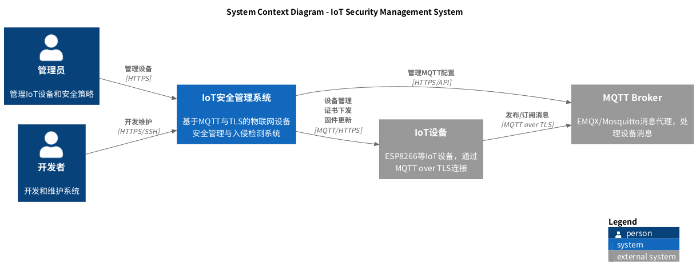
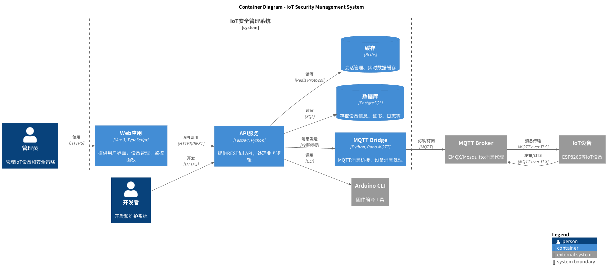
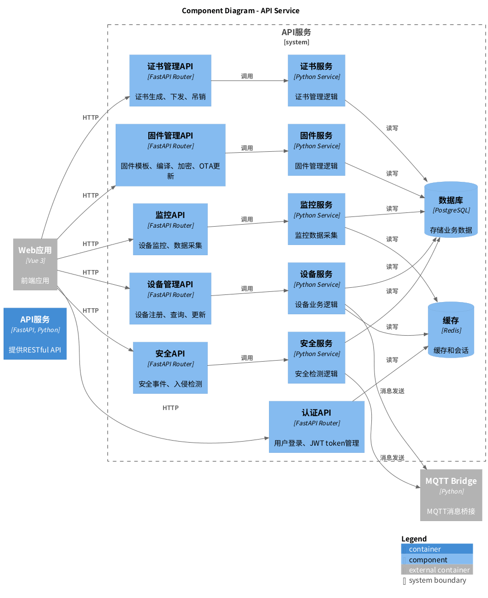
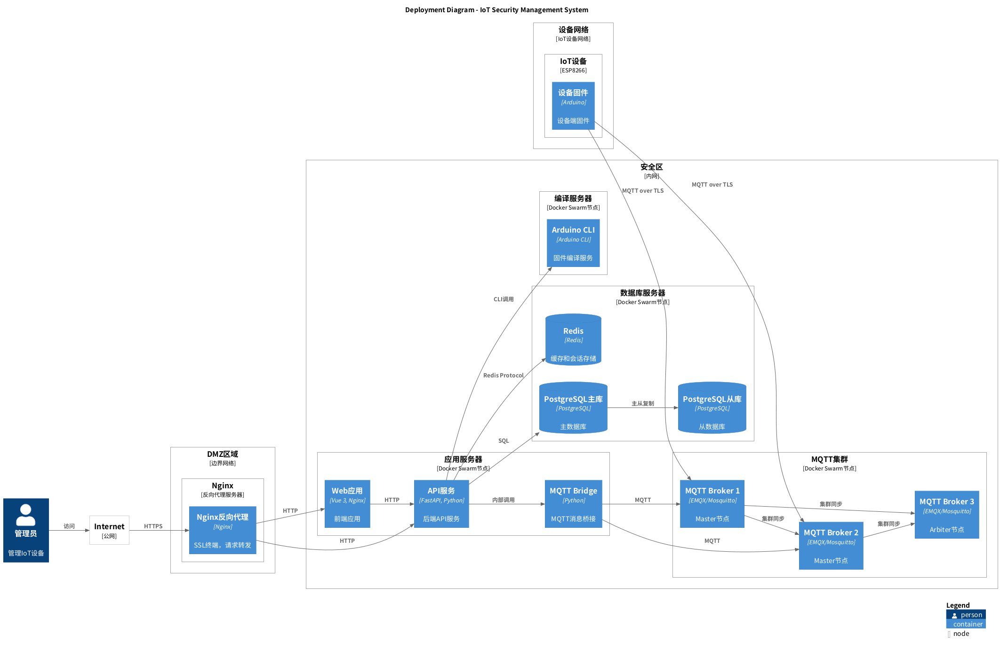

# 智能门锁安全管控平台汇报稿

> 面向领导层的沟通稿，结合 C4 模型与安全设计方案，便于快速制作 PPT。建议每一节对应 1-2 张幻灯片，并配套讲解要点。

## 1. 汇报开场：建设背景与目标
- 物联网门锁散落在园区/楼宇，之前缺乏统一管控、难以追溯安全事件。
- 本项目定位为“智能门锁安全管控平台”，目标是**安全可控、集中可视、可量化运营**。
- 建设原则：零信任架构、合规优先（等保三级+密评）、平台化复用。

**讲稿提示**：突出“统一安全总控 + 边端一体协同”，说明该平台是数字安防的基座投入。

## 2. C4 System Context：全景视图

| 角色/系统 | 交互方式 | 价值点 |
| --- | --- | --- |
| 管理员 | 通过 HTTPS 访问控制台 | 策略配置、报警处置、审计查询 |
| 开发者 | 通过 DevOps/CLI 维护系统 | 快速迭代、固件发布、证书发放 |
| IoT 设备（门锁） | MQTT over TLS （设备↔Broker） | 上报状态、接收控制指令 |
| MQTT Broker/云服务 | 作为安全中枢 | 实现认证、消息治理、审计存储 |

**讲稿提示**：强调“所有链路收敛到 MQTT+HTTPS 安全通道，形成闭环治理”。

## 3. C4 Container：平台分层能力

- **Web 应用（Vue3/TS）**：可视化监控、批量控制、策略向导、报表输出。
- **API 服务（FastAPI）**：承载设备管理、证书下发、命令编排、运维接口。
- **MQTT Bridge**：连接设备与业务规则，引入 QoS、ACL、流控与告警触发。
- **数据层**：PostgreSQL（设备/证书/日志）、Redis（会话与实时指令）、对象/时序存储。
- **外部系统**：Arduino CLI、开发流水线用于固件编译和安全签名。

**价值总结**：容器化部署＋内外网隔离，既能快速扩缩容，又便于安全策略按层布控。

## 4. C4 Component（API Service）：核心链路

| 组件 | 职责 | 安全要点 |
| --- | --- | --- |
| DeviceManager | 设备生命周期、证书与策略发放 | 一机一密、自动轮换、黑白名单 |
| CommandOrchestrator | 指令编排、任务调度、MQTT 下发 | 幂等控制、防重放、指令签名 |
| AuditService | 日志汇聚、合规报表、审计 API | 180 天留存、防篡改存储、告警联动 |
| SecurityService | 零信任策略、风险评分、告警推送 | 与入侵检测联动，支持自动隔离 |

**讲稿提示**：通过此图强调“安全策略即业务规则”，让领导看到可治理的平台能力。

## 5. C4 Deployment：分区部署与韧性

- **DMZ**：WAF/IPS + Nginx 终端，过滤外部威胁。
- **安全区**：MQTT Broker 三节点（主主仲裁）、FastAPI 集群、日志审计系统。
- **数据区**：PostgreSQL 主从、Redis 集群、对象/时序存储。
- **运维**：Prometheus/Grafana 监控、自动化扩缩、30 天密钥轮换。

**指标承诺**：10000+ 持续连接、消息吞吐 1w+/s、系统可用性 99.9%、故障恢复 <5 分钟。

## 6. 安全设计重点

### 6.1 零信任与合规框架
- 安全分层：零信任策略层 → 应用安全 → 传输安全 → 接入安全 → 基础设施。
- 合规：等保三级“身份/访问/审计/加密/备份”全覆盖，满足密评国密算法要求（SM2/SM3/SM4）。
- 统一身份：OAuth2/OIDC + 设备指纹，多因子支持；动态授权与风险评分确保“最小权限”。

### 6.2 设备与通信安全
- 一机一密 X.509 证书，自动轮换、指纹绑定、防克隆。
- TLS 1.3 + 国密 SSL 双证书通道、MQTT ACL 细粒度权限、JWT 防重放。
- 命令双重签名、消息加密 + 完整性校验（SM4-GCM / AES-GCM）。

### 6.3 数据与审计安全
- 数据面：SM4 加密存储、脱敏、KMS/硬件保护、定期密钥轮换。
- 审计面：设备连接、消息发布、订阅、策略操作全量记录 ≥180 天；日志防篡改、实时告警。
- 可视化大屏：安全告警、风险热力、证书到期、入侵拦截统计。

### 6.4 入侵检测与应急响应
- 监测维度：连接异常、流量异常、消息越权、行为偏离。
- 响应机制：自动封禁、会话终止、证书吊销、工单联动；1 秒内推送安全告警。
- 应急流程：发现→评估→处置→恢复→复盘，定期演练，确保可落地。

## 7. 运维与持续改进
- 密钥管理：证书生命周期、备份恢复、密钥逃逸审计。
- 漏洞管理：例行扫描、补丁灰度、基线检查、应急预案。
- 可观察性：Prometheus/Grafana 指标、日志集中化、链路追踪。
- 灾备：数据库定时备份、主从/双活架构、容灾演练、5 分钟以内恢复目标。

## 8. 价值与下一步规划
- **可视**：统一态势感知，实时掌握设备健康与安全风险。
- **可控**：策略集中管理、设备远程控制、自动化证书/固件管理。
- **可信**：端到端加密、零信任、合规可审计，为政企/园区级落地提供背书。
- **可复制**：架构已模块化，可复制到其他 IoT 场景（闸机、摄像头、环境传感器等）。

**后续规划**：
1. 引入 AI 行为分析，提升未知威胁识别能力。
2. 与城市级安防平台对接，输出统一 API／告警联动。
3. 打造“安全运营指挥台”，将运营指标纳入日常 KPI。

---

> **使用建议**：
> - 直接在 PPT 中插入相应 C4 图，配合各节要点即可形成通俗易懂的领导汇报。
> - 如需英文版，可按章节翻译；如需更详细的技术备份，可引用 `docs/SECURITY_DESIGN.md` 等原始文档。
